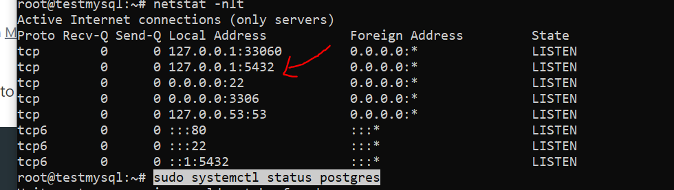
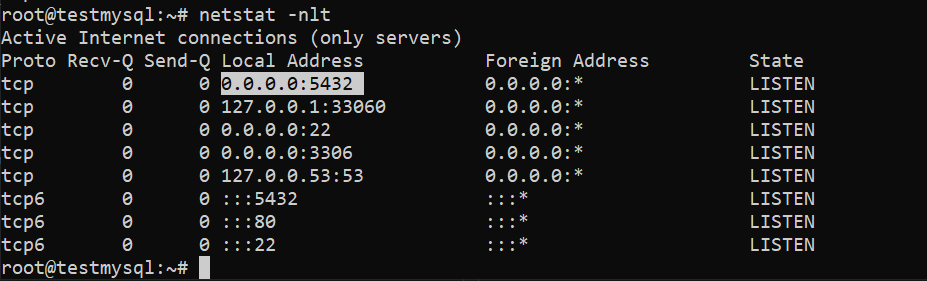

# install-postgresql-and-create-new-user-on-ubuntu-21
install postgresql and create new user on ubuntu 21


## 1/ Install postgresql
```
sudo apt update
sudo apt install postgresql postgresql-contrib
```

check status
```
sudo systemctl status postgres
sudo service postgresql status
sudo pg_isready
```

change password for root
```
sudo -u postgres psql
alter user postgres password '261997';
```

after change success => login again
```
psql -U postgres -h localhost
```


## 2/ Create new user


## 3/ Allow remote connection
```
netstat -nlt
```




change config
```
find / -name "postgresql.conf"
/etc/postgresql/14/main/postgresql.conf
vi /etc/postgresql/14/main/postgresql.conf
```

change FROM
```
listen_addresses = 'localhost'
```
change TO
```
listen_addresses = '*'
```

```
sudo service postgresql status
```


```
netstat -nlt
```




## 4/ Configuring pg_hba.conf
```
find / -name "pg_hba.conf"
/etc/postgresql/14/main/pg_hba.conf
vi /etc/postgresql/14/main/pg_hba.conf
```

add 2 lines at the end of the file
```
host    all             all              0.0.0.0/0                       md5
host    all             all              0.0.0.0/0                       md5
```


## 5/ test connection
```
sudo service postgresql restart
psql -h 139.180.214.105 -U postgres
psql -U postgres -h 139.180.214.105
```